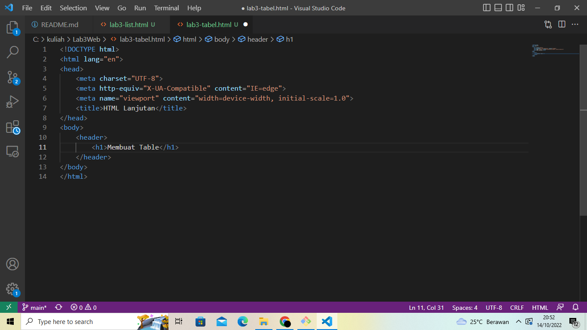
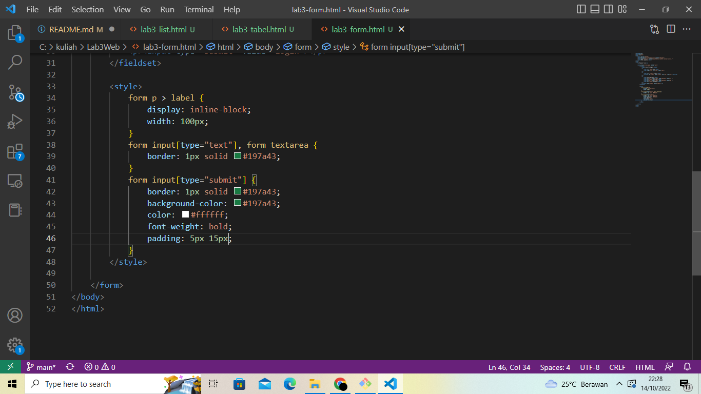
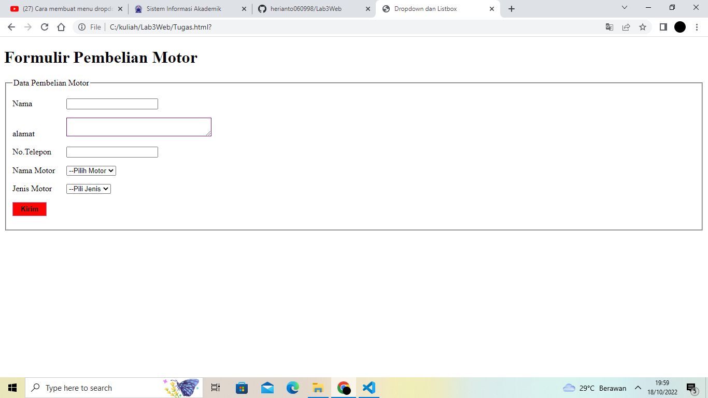

# Lab3Web

# TUGAS 3
| Nama | kelas | Nim | Matkul |
| -- | --- | ---- | ----------- |
| Heri Anto Simamora | TI.21.B.2| 312110365 | Perograman Web |

## MEMBUAT ORDERED LIST

## MEMBUAT UNORDERD LIST 

## MEMBUAT DESCRIPTION LIST

## MEMBUAT TABEL

## MENGGABUNGKAN SEL DATA

## MEMBUAT FORM 

## MENAMBAHKAN STYLE PADA FORM 

## TUGAS DROPDOWN DAN LISTBOX 

